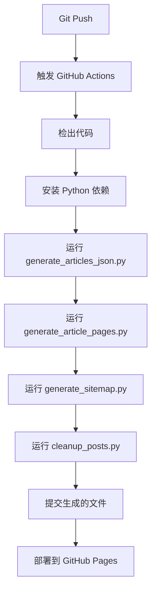
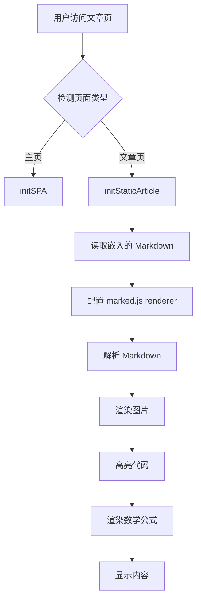

# 本网站结构与技术文档

本文档详细描述 **Yukari502.github.io** 的完整架构、工作流、核心组件及维护指南。

---

## 📋 目录

1. [项目概述](#1-项目概述)
2. [技术栈](#2-技术栈)
3. [目录结构](#3-目录结构)
4. [工作流程](#4-工作流程)
5. [核心脚本与配置详解](#5-核心脚本与配置详解)
6. [前端架构](#6-前端架构)
7. [图片路径解析机制](#7-图片路径解析机制)
8. [常见问题与解决方案](#8-常见问题与解决方案)
9. [维护指南](#9-维护指南)

---

## 1. 项目概述

这是一个基于 **GitHub Pages** 托管的静态博客系统，采用混合渲染策略：
- **构建时处理**：Python 脚本生成静态 HTML 页面
- **运行时渲染**：客户端 JavaScript 将嵌入的 Markdown 转换为 HTML

### 核心特性

- ✅ **自动化构建**：通过 GitHub Actions 自动部署
- ✅ **Markdown 写作**：支持前置元数据（Frontmatter）
- ✅ **客户端渲染**：使用 `marked.js` 解析 Markdown
- ✅ **代码高亮**：使用 `highlight.js` + 自定义 macOS 风格窗口
- ✅ **数学公式**：使用 `KaTeX` 渲染
- ✅ **图表渲染**：使用 `Mermaid.js` 渲染流程图、时序图等
- ✅ **图片管理**：按文章 Slug 组织，图片使用绝对路径引用
- ✅ **SEO 优化**：自动生成 meta 标签、sitemap.xml
- ✅ **响应式设计**：适配桌面和移动设备
- ✅ **自动清理**：同步删除已移除文章的生成文件

---

## 2. 技术栈

### 后端构建工具
- **Python 3.x**
  - `PyYAML`：解析 Frontmatter
  - `os`, `json`, `subprocess`：文件处理和系统调用

### 前端技术
- **原生 HTML5 / CSS3 / JavaScript (ES6+)**
- **Markdown 解析**：[marked.js](https://marked.js.org/)
- **代码高亮**：[highlight.js](https://highlightjs.org/)
- **数学渲染**：[KaTeX](https://katex.org/)
- **图表渲染**：[Mermaid.js](https://mermaid.js.org/) - 支持流程图、时序图、甘特图等
- **字体**：Google Fonts (Outfit, JetBrains Mono)

### 部署平台
- **GitHub Pages**
- **GitHub Actions**：自动化 CI/CD

---

## 3. 目录结构

```plaintext
/Users/kaze/Documents/yukari502.github.io/
│
├── Articles/                          # [源文件] Markdown 文章源码
│   ├── Category1/                     # 可选的分类文件夹
│   │   └── article-name.md            # 文章文件
│   └── article-name.md                # 根目录文章
│
├── Pic/                               # [资源] 图片存储目录
│   └── {article-slug}/                # 每篇文章的图片文件夹（以 Slug 命名）
│       ├── image1.png
│       └── image2.jpg
│
├── posts/                             # [生成物] 静态 HTML 文章页面
│   ├── {category}/                    # 按分类存放
│   │   └── article-slug.html
│   └── uncategorized/                 # 未分类文章
│       └── article-slug.html
│
├── Index/                             # [生成物] JSON 索引数据
│   ├── index.json                     # 主索引（包含年份列表）
│   └── index_{year}.json              # 按年份分片的索引
│
├── articles.json                      # [生成物] 所有文章的汇总（向后兼容）
│
├── generate_articles_json.py          # [构建脚本] 步骤1：解析 Markdown，生成索引
├── generate_article_pages.py          # [构建脚本] 步骤2：生成 HTML 页面
├── generate_sitemap.py                # [构建脚本] 步骤3：生成 sitemap.xml
├── cleanup_posts.py                   # [维护脚本] 清理已删除文章的孤立HTML文件
│
├── article-template.html              # [模板] 文章页面的 HTML 模板
├── index.html                         # [入口] 网站主页（SPA 模式）
├── script.js                          # [逻辑] 核心前端脚本
├── style.css                          # [样式] 全局样式表
│
├── .github/workflows/static.yml       # [CI/CD] GitHub Actions 配置
├── sitemap.xml                        # [SEO] 网站地图
├── pinned-articles.json               # [配置] 置顶文章列表
└── PROJECT_TOPOLOGY.md                # [文档] 本文档
```

---

## 4. 工作流程

### 4.1 内容创作流程


**详细步骤**：

1. **创建文章**
   - 在 `Articles/` 目录下创建 `.md` 文件
   - 可选择放入分类文件夹（如 `Articles/Tech/article.md`）

2. **编写 Frontmatter**
   ```yaml
   ---
   title: 文章标题
   date: 2025-11-22
   description: 文章摘要（用于 SEO）
   category: 技术
   tags: [Python, Web开发]
   ---
   ```

3. **添加图片**
   - 创建文件夹：`Pic/{article-slug}/`
   - 将图片放入此文件夹
   - Markdown 中使用绝对路径引用：``
   - 注意：必须使用以 `/Pic/` 开头的绝对路径，不再支持相对路径自动转换。

4. **提交并推送**
   ```bash
   git add .
   git commit -m "Add new article"
   git push
   ```

### 4.2 自动构建流程



**详细步骤**：

1. **环境准备**（GitHub Actions 自动执行）
   - 安装 Python 3.x
   - 安装 `PyYAML` 依赖

2. **生成索引** (`generate_articles_json.py`)
   - 扫描 `Articles/` 目录
   - 解析每个 `.md` 文件的 Frontmatter
   - 通过 `git log` 获取文件时间戳
   - 生成 `articles.json` 和 `Index/` 目录下的分片索引

3. **生成 HTML** (`generate_article_pages.py`)
   - 读取 `articles.json`
   - 读取 `article-template.html` 模板
   - 替换模板中的占位符（`{TITLE}`, `{CONTENT}` 等）
   - 输出静态 HTML 到 `posts/` 目录

4. **生成 Sitemap** (`generate_sitemap.py`)
   - 收集所有文章 URL
   - 生成 `sitemap.xml`

5. **部署**
   - 提交生成的文件到 Git
   - GitHub Pages 自动部署

### 4.3 运行时渲染流程



---

## 5. 核心脚本与配置详解

### 5.1 `generate_articles_json.py`

**作用**：扫描 Markdown 文件，提取元数据，生成 JSON 索引。

#### 关键函数

##### `parse_frontmatter(content)`
```python
def parse_frontmatter(content):
    """
    从 Markdown 内容中提取 YAML Frontmatter
    
    参数:
        content (str): Markdown 文件内容
    
    返回:
        tuple: (frontmatter_dict, body_content)
    """
```
- **作用**：分离 Frontmatter 和正文
- **解析器**：使用 `PyYAML`
- **格式**：支持 YAML 格式（`---` 分隔）

##### `get_file_dates(filepath)`
```python
def get_file_dates(filepath):
    """
    通过 Git 日志获取文件的创建和修改时间
    
    参数:
        filepath (str): 文件路径
    
    返回:
        dict: {'created': '2025-11-22', 'modified': '2025-11-22'}
    """
```
- **优点**：自动化，无需手动维护时间戳
- **回退**：如果 Git 不可用，使用文件系统时间

##### `slugify(text)`
```python
def slugify(text):
    """
    将文章标题转换为 URL 友好的 Slug
    
    示例: "Hello World!" -> "hello-world"
    """
```
- **规则**：
  - 转小写
  - 移除特殊字符
  - 空格替换为连字符（`-`）
  - 中文保持原样（URL 编码）

#### 输出文件结构

**`Index/index.json`**:
```json
{
  "updated": "2025-11-22 21:02:26",
  "years": ["2025", "2024"]
}
```

**`Index/index_2025.json`**:
```json
{
  "year": "2025",
  "articles": [
    {
      "title": "文章标题",
      "description": "文章摘要",
      "path": "Articles/article.md",
      "date": "2025-11-22",
      "category": "技术",
      "slug": "article-slug",
      "url": "/posts/category/article-slug.html"
    }
  ]
}
```

---

### 5.2 `generate_article_pages.py`

**作用**：根据索引和模板生成静态 HTML 页面。

#### 关键函数

##### `generate_article_html(article, template_content, base_url, output_dir)`
```python
def generate_article_html(article, template_content, base_url, output_dir):
    """
    为单篇文章生成 HTML 页面
    
    参数:
        article (dict): 文章元数据
        template_content (str): HTML 模板内容
        base_url (str): 网站基础 URL
        output_dir (str): 输出目录
    
    返回:
        str: 生成的 HTML 文件路径
    """
```

#### 模板占位符

| 占位符 | 来源 | 示例值 |
|--------|------|--------|
| `{TITLE}` | `article['title']` | "Daily-Bio-Arxiv" |
| `{DESCRIPTION}` | `article['description']` | "文章摘要..." |
| `{KEYWORDS}` | `category + title` | "技术, Daily-Bio-Arxiv" |
| `{URL}` | `base_url + url` | "https://yukari502.github.io/posts/..." |
| `{DATE}` | `article['date']` | "2025-11-22" |
| `{CATEGORY}` | `article['category']` | "Uncategorized" |
| `{CONTENT}` | 文件内容（转义后） | Markdown 源码 |
| `{SLUG}` | `article['slug']` | "daily-bio-arxiv" |
| `{ROOT_PATH}` | 计算的相对路径 | "../../" |

#### 关键逻辑

**1. HTML 安全转义**
```python
replacements = {
    '{TITLE}': html.escape(article['title']),
    '{DESCRIPTION}': html.escape(article.get('description', '')[:160]),
    # ...
}
```
- **目的**：防止 XSS 攻击
- **方法**：使用 `html.escape()` 转义特殊字符

**2. Script 标签保护**
```python
'{CONTENT}': markdown_content.replace('</script>', '<\\/script>')
```
- **问题**：Markdown 中的 `</script>` 会提前关闭 `<script>` 标签
- **解决**：转义为 `<\\/script>`

**3. 相对路径计算**
```python
# 计算从文章目录到项目根目录的相对路径
relative_root = os.path.relpath('.', article_output_dir)
# posts/uncategorized/article.html -> "../../"
```
- **目的**：支持本地文件访问和 GitHub Pages 部署
- **应用**：加载 `style.css`, `script.js`, 图片资源

---

### 5.3 `generate_sitemap.py`

**作用**：生成 SEO 友好的 `sitemap.xml`。

#### 输出格式
```xml
<?xml version="1.0" encoding="UTF-8"?>
<urlset xmlns="http://www.sitemaps.org/schemas/sitemap/0.9">
  <url>
    <loc>https://yukari502.github.io/posts/uncategorized/article.html</loc>
    <lastmod>2025-11-22</lastmod>
    <changefreq>monthly</changefreq>
    <priority>0.8</priority>
  </url>
</urlset>

```

---

### 5.4 `cleanup_posts.py`

**作用**：同步清理 `posts/` 目录，删除已在 `Articles/` 中移除的文章对应的 HTML 文件。

#### 关键逻辑

1. **读取索引**：加载 `articles.json` 获取当前所有有效的文章路径。
2. **扫描文件**：遍历 `posts/` 目录下的所有 `.html` 文件。
3. **比对与删除**：
   - 计算每个 HTML 文件的相对路径。
   - 若路径不在有效列表中，则视为孤立文件并删除。
4. **清理空目录**：递归删除清理后变为空的分类文件夹。

#### 使用方式

**本地运行**：
```bash
python3 cleanup_posts.py
```

**CI 集成**：
已集成到 GitHub Actions 工作流中，在生成新页面后自动执行。


---

### 5.5 配置文件：`pinned-articles.json`

**作用**：定义在首页置顶显示的文章列表。

**格式**：JSON 数组，包含文章的相对路径（相对于项目根目录）。

**示例**：
```json
[
  "Articles/daily-bio-arxiv.md",
  "Articles/Another-Article.md"
]
```

**注意**：
- 路径必须与 `articles.json` 中的 `path` 字段完全匹配（通常是 `Articles/filename.md`）。
- 前端脚本 (`script.js`) 会读取此文件，并根据路径筛选出对应的文章对象，优先展示在首页顶部。
- 如果文件不存在或为空数组，置顶区域将自动隐藏或显示无内容提示。

---

## 6. 前端架构

### 6.1 `script.js` 核心逻辑

#### 模式检测
```javascript
document.addEventListener('DOMContentLoaded', () => {
    const markdownSource = document.getElementById('markdown-source');
    
    if (markdownSource) {
        initStaticArticle();  // 文章页模式
    } else {
        initSPA();            // 主页 SPA 模式
    }
});
```

---

### 6.2 静态文章模式 (`initStaticArticle`)

#### 执行流程

1. **初始化主题**
   ```javascript
   const savedTheme = localStorage.getItem('theme') || 'dark';
   document.documentElement.setAttribute('data-theme', savedTheme);
   ```

2. **读取元数据**
   ```javascript
   const articleSlugMeta = document.querySelector('meta[name="article-slug"]');
   const articleSlug = articleSlugMeta ? articleSlugMeta.content : '';
   
   const rootPathMeta = document.querySelector('meta[name="root-path"]');
   const rootPath = rootPathMeta ? rootPathMeta.content : '/';
   ```

3. **配置 Marked.js Renderer**

   **代码渲染器** (`renderer.code`)
   ```javascript
   renderer.code = function (code, language) {
       // 类型检查和转换
       code = String(code || '');
       
       // 处理对象类型的 code (marked.js 有时会传递 token)
       if (typeof code === 'object' && code !== null) {
           code = code.text || code.raw || '';
       }
       
       // 检查 highlight.js 是否加载
       if (typeof hljs === 'undefined') {
           return `<pre><code>${code}</code></pre>`;
       }
       
       // 高亮代码
       const highlighted = hljs.highlight(code, { language }).value;
       
       // 返回自定义 HTML（macOS 风格窗口）
       return `
       <div class="code-window">
           <div class="window-header">
               <div class="window-controls">
                   <span class="dot red"></span>
                   <span class="dot yellow"></span>
                   <span class="dot green"></span>
               </div>
               <div class="window-title">${language.toUpperCase()}</div>
               <button class="copy-btn" onclick="copyCode(this)">...</button>
           </div>
           <pre><code class="hljs ${language}">${highlighted}</code></pre>
       </div>`;
   };
   ```

   **图片渲染器** (`renderer.image`) - **核心修复点**
   ```javascript
   renderer.image = function (href, title, text) {
       // ⚠️ 关键修复：处理 marked.js 传递的对象
       if (typeof href === 'object' && href !== null) {
           href = href.href || href.raw || '';
       }
       
       // 确保 href 是字符串
       href = String(href || '');
       if (!href) return '';
       
       // 处理相对路径
       if (!href.startsWith('http') && !href.startsWith('/') && !href.startsWith('data:')) {
           // 提示：现在推荐使用绝对路径 /Pic/...
           // 相对路径不再自动转换为 Pic/{slug}/...
       }
       
       // 转义 HTML 特殊字符
       const safeText = String(text || '').replace(/"/g, '&quot;');
       const safeTitle = String(title || '').replace(/"/g, '&quot;');
       
       return ``;
   };
   ```

4. **解析 Markdown**
   ```javascript
   const htmlContent = marked.parse(markdownSource.textContent, { renderer });
   contentDiv.innerHTML = htmlContent;
   ```

5. **渲染数学公式**
   ```javascript
   if (window.renderMathInElement) {
       renderMathInElement(contentDiv, {
           delimiters: [
               { left: '$$', right: '$$', display: true },
               { left: '$', right: '$', display: false }
           ]
       });
   }
   ```

---

### 6.3 SPA 模式 (`initSPA`)

用于主页 (`index.html`) 的单页应用逻辑：

#### 功能模块

1. **文章列表加载**
   ```javascript
   async function fetchArticles() {
       // 优先加载分片索引
       const response = await fetch('Index/index.json');
       const mainIndex = await response.json();
       
       for (const year of mainIndex.years) {
           const yearData = await fetch(`Index/index_${year}.json`);
           articles.push(...yearData.articles);
       }
       
       return articles.sort((a, b) => new Date(b.date) - new Date(a.date));
   }
   ```

2. **搜索功能**
   ```javascript
   searchInput.addEventListener('input', (e) => {
       const query = e.target.value.toLowerCase();
       const filtered = allArticles.filter(article =>
           article.title.toLowerCase().includes(query) ||
           article.description.toLowerCase().includes(query)
       );
       renderArticles(filtered);
   });
   ```

3. **分类导航**
   - 自动提取所有分类
   - 可折叠的分类树
   - 点击文章跳转到静态页面

---

## 7. 图片路径解析机制

### 7.1 路径规范

- **Markdown 引用**：``
- **实际位置**：`/Pic/article-slug/image.png`
- **规则**：必须使用以 `/Pic/` 开头的绝对路径。

### 7.2 路径示例

| Markdown 路径 | 说明 |
|--------------|-----------|
| `/Pic/article-slug/image.png` | ✅ 正确（绝对路径） |
| `image.png` | ❌ 错误（不再支持相对路径） |
| `Pic/article-slug/image.png` | ❌ 错误（缺少开头的 /） |
| `https://example.com/img.png` | ✅ 正确（外部链接） |

---

## 8. 常见问题与解决方案

### 8.1 图片无法显示

#### 症状

- 文章页显示 "Error rendering content"
- 控制台错误：`TypeError: href.startsWith is not a function`

#### 根本原因

`marked.js` 有时传递**对象（token）**而非字符串给 `renderer.image`。

#### 解决方案（已修复）

```javascript
// 在 renderer.image 开头添加类型检查
if (typeof href === 'object' && href !== null) {
    href = href.href || href.raw || '';
}
href = String(href || '');
```
 
 ---
 
### 8.2 代码块显示为 `[object Object]`

#### 根本原因

同上，`marked.js` 传递对象给 `renderer.code`。

#### 解决方案

```javascript
renderer.code = function (code, language) {
    code = String(code || '');
    if (typeof code === 'object' && code !== null) {
        code = code.text || code.raw || '';
    }
    // ...
};
```

---

### 8.3 Frontmatter 解析失败

#### 症状
文章不显示或显示默认标题。

#### 可能原因
1. Frontmatter 格式错误（YAML 语法）
2. 缺少闭合的 `---`
3. 日期格式不正确

#### 正确格式
```yaml
---
title: 文章标题
date: 2025-11-22
description: 简短摘要
category: 分类名
---
```

---

### 8.4 GitHub Actions 构建失败

#### 常见原因
1. **缺少依赖**：检查 `PyYAML` 是否安装
2. **Git 配置错误**：确保有权限提交
3. **文件路径问题**：Windows/Linux 路径差异

#### 调试方法
查看 GitHub Actions 日志：
```
Repository -> Actions -> 点击失败的 workflow -> 查看详细日志
```

---

## 9. 维护指南

### 9.1 添加新文章

```bash
# 1. 创建 Markdown 文件
vim Articles/new-article.md

# 2. 添加 Frontmatter
# （参考 8.3 节）

# 3. 创建图片文件夹（如果需要）
mkdir Pic/new-article

# 4. 提交并推送
git add .
git commit -m "Add new article: new-article"
git push
```

### 9.2 本地测试

```bash
# 1. 生成索引和页面
python3 generate_articles_json.py
python3 generate_article_pages.py

# 2. 在浏览器打开
open posts/category/article-slug.html
```

### 9.3 修改样式

- **全局样式**：编辑 `style.css`
- **文章页样式**：编辑 `article-template.html` 中的 `<style>` 标签
- **代码块样式**：修改 `script.js` 中的 `renderer.code` 返回的 HTML

### 9.4 更新依赖

```bash
# 检查 Python 依赖
pip list | grep PyYAML

# 前端库（通过 CDN，无需本地安装）
# 如需更新版本，修改 HTML 中的 CDN 链接
```

### 9.5 调试技巧

#### 前端错误
1. 打开浏览器开发者工具（F12）
2. 查看 Console 标签
3. 检查 Network 标签（资源加载）

#### 后端错误
1. 查看 GitHub Actions 日志
2. 本地运行 Python 脚本，观察输出

#### 图片问题
1. 检查 `Pic/` 目录结构
2. 验证 `article-slug` 是否匹配文件夹名
3. 查看浏览器 Network 标签，确认请求的路径

---

## 10. 性能优化建议

### 10.1 已实现
- ✅ 分片索引（按年份）
- ✅ 客户端渲染（减轻服务器压力）
- ✅ CDN 加载第三方库

### 10.2 可选优化
- 图片压缩（使用 TinyPNG 等工具）
- 懒加载图片（添加 `loading="lazy"` 属性）
- 代码分割（分离 SPA 和文章页 JS）

---

## 11. 安全注意事项

### 11.1 已实施
- ✅ HTML 转义（`html.escape()`）
- ✅ Script 标签保护（转义 `</script>`）
- ✅ HTTPS（GitHub Pages 强制）

### 11.2 建议
- 定期更新第三方库（marked.js, highlight.js）
- 不在 Markdown 中嵌入用户输入
- 检查 GitHub Actions secrets 安全性

---

## 12. 快速参考

### 常用命令
```bash
# 完整构建流程
python3 generate_articles_json.py && \
python3 generate_article_pages.py && \
python3 generate_sitemap.py

# 提交并部署
git add . && git commit -m "Update" && git push

# 强制推送（慎用）
git push origin main --force
```

### 重要文件路径
- **文章模板**：`article-template.html`
- **主页**：`index.html`
- **核心脚本**：`script.js`
- **全局样式**：`style.css`
- **CI/CD 配置**：`.github/workflows/static.yml`

---

**最后更新**：2025-11-22  
**维护者**：Yukari502 & Gemini 3.0 pro
**版本**：v2.1
