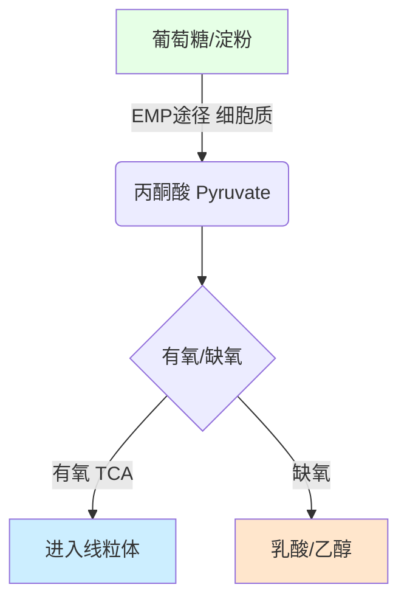
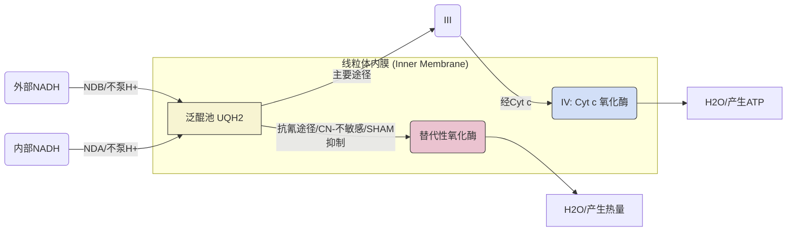
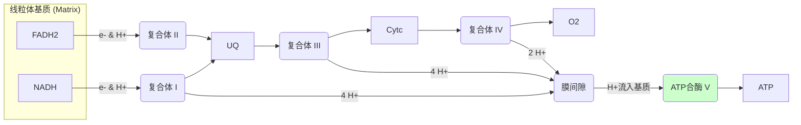

# 植物呼吸作用

## 目录

- [植物呼吸作用](#植物呼吸作用)
  - [目录](#目录)
  - [1. 呼吸作用的概念与生理意义](#1-呼吸作用的概念与生理意义)
    - [1.1 呼吸作用的概念](#11-呼吸作用的概念)
    - [1.2 呼吸作用的生理意义](#12-呼吸作用的生理意义)
  - [2. 植物呼吸代谢途径概述](#2-植物呼吸代谢途径概述)
    - [2.1 淀粉和蔗糖的降解流程](#21-淀粉和蔗糖的降解流程)
    - [2.2 糖酵解途径 (Glycolysis Pathway, EMP)](#22-糖酵解途径-glycolysis-pathway-emp)
    - [2.3 三羧酸循环 (Tricarboxylic Acid Cycle, TCA)](#23-三羧酸循环-tricarboxylic-acid-cycle-tca)
    - [2.4 磷酸戊糖途径 (Pentose Phosphate Pathway, PPP)](#24-磷酸戊糖途径-pentose-phosphate-pathway-ppp)
    - [2.5 EMP、TCA、PPP 途径对比表格](#25-emptcappp-途径对比表格)
    - [2.6 $	ext{EMP}$、$	ext{TCA}$、$	ext{PPP}$ 途径流程图](#26-extempexttcaextppp-途径流程图)
      - [2.6.1 糖酵解途径 ($\\text{EMP}$ Pathway) 流程](#261-糖酵解途径-textemp-pathway-流程)
    - [2. 三羧酸循环 ($\\text{TCA}$ Cycle) 流程](#2-三羧酸循环-texttca-cycle-流程)
    - [3. 呼吸电子传递链 ($\\text{ETC}$) 流程与质子转运](#3-呼吸电子传递链-textetc-流程与质子转运)
    - [4. 替代性呼吸（抗氰途径）分支流程](#4-替代性呼吸抗氰途径分支流程)
  - [3. 呼吸电子传递链与氧化磷酸化](#3-呼吸电子传递链与氧化磷酸化)
    - [3.1 呼吸电子传递链 (Electron Transport Chain, ETC)](#31-呼吸电子传递链-electron-transport-chain-etc)
      - [ETC 组分和特征](#etc-组分和特征)
    - [3.2 氧化磷酸化 (Oxidative Phosphorylation) 与 $\\text{P/O}$ 比值](#32-氧化磷酸化-oxidative-phosphorylation-与-textpo-比值)
  - [4. 能量耗散途径与抗氰呼吸](#4-能量耗散途径与抗氰呼吸)
    - [4.1 替代性氧化酶 (Alternative Oxidase, AOX) 机制](#41-替代性氧化酶-alternative-oxidase-aox-机制)
    - [4.2 解偶联蛋白 (Uncoupling Protein, UCP) 机制](#42-解偶联蛋白-uncoupling-protein-ucp-机制)
    - [4.3 鱼藤酮不敏感的 $\\text{NAD(P)H}$ 脱氢酶](#43-鱼藤酮不敏感的-textnadph-脱氢酶)
  - [5. 呼吸代谢的调控机制](#5-呼吸代谢的调控机制)
    - [5.1 $\\text{EMP}$ 途径的调控](#51-textemp-途径的调控)
    - [5.2 $\\text{TCA}$ 途径的调控](#52-texttca-途径的调控)
    - [5.3 $\\text{PPP}$ 途径的调控](#53-textppp-途径的调控)
    - [5.4 能荷 (Energy Charge, EC) 调控](#54-能荷-energy-charge-ec-调控)

## 1. 呼吸作用的概念与生理意义

### 1.1 呼吸作用的概念

**植物呼吸作用** (Plant respiration)：呼吸作用及其相关的碳代谢，以受控的方式释放储存在碳化合物中的能量供细胞使用。同时，它也为其他生物合成提供许多碳前体。

* **总反应式**：$\text{C}_6\text{H}_{12}\text{O}_6 + 6 \text{ O}_2 + 6 \text{ H}_2\text{O} \rightarrow 6 \text{ CO}_2 + 12 \text{ H}_2\text{O}$

### 1.2 呼吸作用的生理意义

1. 为植物生命活动**提供能量**。
2. 是**植物代谢的中心**：为合成其他重要有机物提供前体。
3. 参与植物对生物和非生物胁迫的**耐受**。
4. **保护叶绿体**和**提高光合作用**。
5. 参与**氮代谢的调节**。

## 2. 植物呼吸代谢途径概述

### 2.1 淀粉和蔗糖的降解流程

* **淀粉降解**：淀粉可通过**磷酸化**和**水解**降解。
  * **淀粉磷酸化酶** (Starch phosphorylase)：从非还原端逐一切割葡萄糖，生成 **$\text{G-1-P}$**。
  * **$\alpha$-淀粉酶** ($\alpha$-amylase)：水解 $\alpha$-1,4-和 $\alpha$-1,6-糖苷键。
  * **$\beta$-淀粉酶** ($\beta$-amylase)：从非还原端逐一切割 **$\beta$-麦芽糖**。
* **蔗糖降解**：
  * **转化酶** (Invertase)：水解蔗糖生成**葡萄糖**和**果糖**。碱性转化酶位于细胞质，酸性转化酶位于液泡和细胞壁。
  * **蔗糖合酶** (Sucrose synthase)：催化蔗糖和 $\text{UDP}$ 生成果糖和 $\text{UDP}$-葡萄糖。

### 2.2 糖酵解途径 (Glycolysis Pathway, EMP)

**糖酵解途径** ($\text{EMP}$ pathway): 在该代谢途径中，葡萄糖或淀粉经过一系列**厌氧氧化**过程分解为**丙酮酸**。

*   **位点**: 细胞质 (Cytoplasm)。
*   **反应流程**:
    $$\text{Glucose} + 2\text{NAD}^+ + 2\text{ADP} + 2\text{Pi} \rightarrow 2\text{Pyruvate} + 2\text{NADH} + 2\text{H}^+ + 2\text{ATP} + 2\text{H}_2\text{O}$$。
*   **限速步骤**: 糖酵解的速率取决于**磷酸果糖激酶** ($\text{PF}$ kinase) 的活性。
*   **厌氧呼吸**: 在厌氧或缺氧条件下，呼吸底物被部分氧化和分解，产生的能量较少。高等植物的产物为**乳酸** ($\text{lactic acid}$) 或**乙醇** ($\text{ethanol}$)。

**EMP 途径简化流程 (Mermaid)**:



### 2.3 三羧酸循环 (Tricarboxylic Acid Cycle, TCA)

**三羧酸循环** ($\text{TCA}$ cycle, Krebs cycle, Citric acid cycle): 丙酮酸通过丙酮酸转运体导入线粒体基质，进行**完全氧化降解**，生成 $\text{CO}_2$ 和 $\text{H}_2\text{O}$。

*   **位点**: 线粒体基质 (Mitochondrial Matrix)。
*   **产物** (每分子丙酮酸输出): **4** 分子 $\text{NADH}+\text{H}^+$、**1** 分子 $\text{FADH}_2$、**1** 分子 $\text{ATP}$、**3** 分子 $\text{CO}_2$。
*   **植物 $\text{TCA}$ 循环的特征**:
    1.  由**琥珀酰 $\text{CoA}$ 合成酶** ($\text{succinyl}-\text{CoA}$ synthetase) 催化的步骤在植物中生成 **$\text{ATP}$**（动物中生成 $\text{GTP}$）。
    2.  为其他重要有机物（如脂肪酸、类胡萝卜素、$\text{GA}$ 等）的合成**提供前体**。
    3.  植物线粒体中存在大量的 **$\text{NAD}^+$-苹果酸酶** ($\text{NAD}^+$-malic enzyme)，可催化**苹果酸转化为丙酮酸**。

### 2.4 磷酸戊糖途径 (Pentose Phosphate Pathway, PPP)

**磷酸戊糖途径** ($\text{PPP}$): 也被称为**己糖单磷酸途径** ($\text{HMP}$)、**己糖磷酸旁路**或**葡萄糖直接氧化途径**。

*   **位点**: 细胞质 (Cytoplasm)、叶绿体/质体 (Chloroplast/plastid)。
*   **两阶段**:
    1.  **氧化阶段** (Oxidation stage): 发生 **2 次脱氢**和 **1 次脱羧**反应。$\text{G-6-P} \rightarrow \text{Ru-5-P} + 2\text{NADPH} + \text{CO}_2$。
    2.  **非氧化阶段** (Non oxidation stage)。
*   **生理意义**:
    1.  产生 **$\text{NADPH}$**，为许多生物合成反应（如脂肪酸合成、氮代谢）提供**还原力**。
    2.  中间产物（例如 $\text{E-4-P}$，赤藓糖-4-磷酸）参与其他代谢，例如**酚类化合物**的形成。

### 2.5 EMP、TCA、PPP 途径对比表格

| 途径 | 发生位点 | 氧气依赖性 | 主要功能和产物 |
| :--- | :--- | :--- | :--- |
| **$\text{EMP}$ 途径** | 细胞质 | 厌氧氧化 | 葡萄糖分解为丙酮酸；产生 $\text{ATP}$ 和 $\text{NADH}$。 |
| **$\text{TCA}$ 循环** | 线粒体基质 | 有氧氧化 | 丙酮酸完全氧化为 $\text{CO}_2$ 和 $\text{H}_2\text{O}$；产生大量的 $\text{NADH}$ 和 $\text{FADH}_2$；提供碳骨架前体。 |
| **$\text{PPP}$ 途径** | 细胞质、叶绿体/质体 | 氧化阶段产 $\text{CO}_2$ | 产生 **$\text{NADPH}$**（还原力）；提供戊糖和 $\text{E-4-P}$ 等中间产物。 |

### 2.6 $	ext{EMP}$、$	ext{TCA}$、$	ext{PPP}$ 途径流程图

#### 2.6.1 糖酵解途径 ($\text{EMP}$ Pathway) 流程

$\text{EMP}$ 途径发生在细胞质中，将葡萄糖或淀粉分解为丙酮酸。

```mermaid
graph TD
    A[葡萄糖 Glucose] -->|1. 己糖激酶/消耗ATP| B(G-6-P);
    B -->|2. 磷酸己糖异构酶| C(F-6-P);
    C -->|3. PF激酶/限速酶/消耗ATP| D(F-1,6-P);
    D -->|4. 醛缩酶| E1(GAP 3-磷酸甘油醛);
    D -->|4. 醛缩酶| E2(DHAP 二羟丙酮磷酸);  
    E2 -->|5. 磷酸丙糖异构酶| E1;
    E1 -->|6. GAP脱氢酶/生成NADH| F(1,3-BGP);
    F -->|7. PGA激酶/生成ATP| G(3-PGA);
    G -->|8. PGA变位酶| H(2-PGA);
    H -->|9. 烯醇化酶/脱水| I(PEP 磷酸烯醇式丙酮酸);
    I -->|10. 丙酮酸激酶/生成ATP| J[丙酮酸 Pyruvate];

    subgraph "细胞质 (Cytoplasm)"
        A
        B
        C
        D
        E1
        E2
        F
        G
        H
        I
        J
    end

    style A fill:#D2EBF7,stroke:#333
    style J fill:#CCFFCC,stroke:#333
```



*   **关键步骤**：步骤 3 (磷酸果糖激酶，$\text{PF}$ kinase) 是限速酶；步骤 6 ( $\text{GAP}$ 脱氢酶) 生成 $\text{NADH}$；步骤 7 和 10 属于底物水平磷酸化，生成 $\text{ATP}$。

### 2. 三羧酸循环 ($\text{TCA}$ Cycle) 流程

$\text{TCA}$ 循环发生在**线粒体基质**中，将丙酮酸完全氧化降解成 $\text{CO}_2$ 和 $\text{H}_2\text{O}$。

```mermaid
graph TD
    A[丙酮酸 Pyruvate] -->|① 丙酮酸脱氢酶复合体/释放CO2/生成NADH| B(乙酰CoA Acetyl CoA);
    OAA[草酰乙酸 Oxaloacetate];
    B -->|② 柠檬酸合酶| C;
    OAA -->|② 柠檬酸合酶| C;
    C(柠檬酸 Citrate) -->|③ 顺乌头酸酶| D(异柠檬酸 Isocitrate);
    D -->|④ 异柠檬酸酶/释放CO2/生成NADH| E(a-酮戊二酸 a-Ketoglutarate);
    E -->|⑤ a-酮戊二酸脱氢酶/释放CO2/生成NADH| F(琥珀酰CoA Succinyl CoA);
    F -->|⑥ 琥珀酸CoA合成酶/生成ATP| G(琥珀酸 Succinate);
    G -->|⑦ 琥珀酸脱氢酶/生成FADH2| H(延胡索酸 Fumarate);
    H -->|⑧ 延胡索酸水化酶/水合| I(苹果酸 Malate);
    I -->|⑨ 苹果酸脱氢酶/生成NADH| OAA;

    subgraph "线粒体基质 (Mitochondrial Matrix)"
        A
        B
        C
        D
        E
        F
        G
        H
        I
        OAA
    end

    style A fill:#D2EBF7,stroke:#333
    style G fill:#E8D2F7,stroke:#333
    style B fill:#CCFFCC,stroke:#333
    style OAA fill:#E8D2F7,stroke:#333
```



*   **关键步骤**：步骤 ⑥ (琥珀酸 $\text{CoA}$ 合成酶) 在植物中生成 $\text{ATP}$。步骤 ⑦ (琥珀酸脱氢酶) 位于线粒体内膜，是复合体 $\text{II}$ 的主要成分。

### 3. 呼吸电子传递链 ($\text{ETC}$) 流程与质子转运

$\text{ETC}$ 位于**线粒体内膜**，通过复合体 ($\text{I}$ 到 $\text{IV}$) 将电子传递给 $\text{O}_2$，同时将 $\text{H}^+$ 泵入膜间隙，建立质子动力势 ($\text{pmf}$)，驱动 $\text{ATP}$ 合成（复合体 $\text{V}$）。

```mermaid
graph LR
    subgraph "线粒体基质 (Matrix)"
        NADH(来自TCA/EMP/其他)
        FADH2(来自TCA)
        ADP_Pi("ADP + Pi")
    end

    subgraph "线粒体内膜 (Inner Membrane)"
        C1("I: NADH 氧化还原酶")
        C2("II: 琥珀酸脱氢酶")
        UQ(泛醌/电子载体)
        C3("III: Cyt bc1 复合体")
        Cytc("细胞色素 c/可移动色素蛋白")
        C4("IV: Cyt c 氧化酶")
        C5("V: ATP 合酶")
    end

    subgraph "膜间隙 (Intermembrane Space)"
        H_IMS["H+ 浓度高"]
    end

    NADH -- "2 e-, 4 H+泵出" --> C1;
    FADH2 -- "2 e-" --> C2;
    C1 -- "2 e-" --> UQ;
    C2 -- "2 e-" --> UQ;
    UQ -- "2 e-, 4 H+泵出" --> C3;
    C3 -- "2 e-" --> Cytc;
    Cytc -- "2 e-" --> C4;
    C4 -- "2 e-, 2 H+泵出" --> O2[\"O2 + 4H+基质 -> 2H2O\"];

    C1 -- "4 H+泵出" --> H_IMS;
    C3 -- "4 H+泵出" --> H_IMS;
    C4 -- "2 H+泵出" --> H_IMS;

    H_IMS -- "H+流入基质" --> C5;
    C5 -- "合成ATP" --> ATP(ATP);
    
    style C5 fill:#ccffcc,stroke:#333
```

*   **质子转运**：复合体 $\text{I}$ 泵出 $4 \text{ H}^+$，复合体 $\text{III}$ 泵出 $4 \text{ H}^+$，复合体 $\text{IV}$ 泵出 $2 \text{ H}^+$。
*   **能量转换**：$\text{H}^+$ 流入基质，推动 $\text{ATP}$ 合酶的 $\gamma$-亚基旋转，引发 $\beta$-亚基的构象变化（**紧密-松弛-开放**），完成 $\text{ATP}$ 的合成。

### 4. 替代性呼吸（抗氰途径）分支流程

植物线粒体具有代谢多样性，存在抗氰呼吸途径，用于耗散多余能量，不受复合体 $\text{IV}$ 抑制剂氰化物 ($\text{CN}^-$) 的影响。



*   **机制**：$\text{AOX}$ 绕过了 $\text{Cyt}$ 途径的 $\text{Cyt bc}_1$ (复合体 $\text{III}$) 和 $\text{Cyt c}$ 氧化酶 (复合体 $\text{IV}$) 部分，直接将电子从 $\text{UQH}_2$ 传递给 $\text{O}_2$。此过程**不伴随质子泵出**，因此能量以热能形式耗散。
*   **非质子泵出脱氢酶**：$\text{NDB}$ 和 $\text{NDA}$ 等脱氢酶将电子传递给 $\text{UQ}$ **不伴随质子泵出**，是另一种低 $\text{P/O}$ 的分支途径。

## 3. 呼吸电子传递链与氧化磷酸化

### 3.1 呼吸电子传递链 (Electron Transport Chain, ETC)

呼吸电子传递链位于**线粒体内膜** (inner membrane)，包括四个酶复合体 ($\text{I}$ 到 $\text{IV}$) 和 $\text{ATP}$ 合酶（复合体 $\text{V}$）。电子从 $\text{NADH}$ 和 $\text{FADH}_2$ 传递给 $\text{O}_2$，同时驱动 $\text{H}^+$ 跨内膜转运，建立**质子动力势** ($\text{pmf}$)。

#### ETC 组分和特征

| 复合体 | 功能/电子传递 | 质子转运 | 抑制剂 | 来源 |
| :--- | :--- | :--- | :--- | :--- |
| **复合体 $\text{I}$** ($\text{NADH}$: $\text{UQ}$ 氧化还原酶) | 传输 $\text{NADH}$ 的电子到 $\text{UQ}$，电子载体为 $\text{FMN}, \text{Fe}-\text{S}$。 | **$4 \text{ H}^+$** | **鱼藤酮** ($\text{Rotenone}$)，**杀粉蝶菌素 $\text{A}$** ($\text{Piercidins A}$)。 |
| **复合体 $\text{II}$** (琥珀酸: $\text{UQ}$ 氧化还原酶) | 琥珀酸氧化为延胡索酸，电子转移到 $\text{UQ}$，不伴随 $\text{H}^+$ 转移。 | **不转运 $\text{H}^+$** | **噻吩甲酰三氟丙酮** ($\text{TTFA}$)。 |
| **复合体 $\text{III}$** ($\text{UQH}_2$: $\text{Cyt c}$ 氧化还原酶) | 电子从 $\text{UQH}_2$ 传递给 $\text{Cyt c}$。 | **$4 \text{ H}^+$** | **抗霉素 $\text{A}$** ($\text{Antimycin A}$)。 |
| **复合体 $\text{IV}$** ($\text{Cyt c}$ 氧化酶) | 将电子传递给 $\text{O}_2$。 | **$2 \text{ H}^+$** | $\text{CO}$、**氰化物** ($\text{CN}^-$)、**叠氮化物** ($\text{N}_3^-$)。 |
| **泛醌** ($\text{UQ}$) | **脂溶性**，非蛋白质成员，可在膜脂中自由移动，是复合体 $\text{I}$、$\text{II}$ 和 $\text{III}$ 之间的电子载体。 | - | - |
| **细胞色素 $\text{c}$ ($\text{Cyt c}$)** | **周缘蛋白**，是电子传递链中**唯一的可移动色素蛋白**。 | - | - |

**呼吸体** (Respirasome): 由复合体 $\text{I}$、$\text{III}_2$ 和 $\text{IV}_4$ 等形成的大型超聚合物，可以在 $\text{Cyt c}$ 和 $\text{UQ}$ 存在时**自主进行呼吸**。

**呼吸电子传递链简化流程 (Mermaid)**:



### 3.2 氧化磷酸化 (Oxidative Phosphorylation) 与 $\text{P/O}$ 比值

**氧化磷酸化** (Oxidative phosphorylation): 生物氧化过程中的磷酸化，是**有氧生物合成 $\text{ATP}$ 的主要方式**。

*   **机制**: $\text{P. Mitchell}$ 的**化学渗透假说** (Chemiosmotic hypothesis) 认为，**跨膜的质子动力势** ($\text{pmf}$) 是驱动 $\text{ATP}$ 合成的驱动力。
*   **$\text{ATP}$ 合酶** (复合体 $\text{V}$):
    *   **结构**: $\text{F}_1$ 位于基质（催化位点）；$\text{F}_0$ 嵌入内膜（$\text{H}^+$ 通道）。
    *   **变构学说** (Binding-change model): $\text{H}^+$ 流动推动 $\text{F}_1$ 的 $\gamma$-亚基旋转 $\rightarrow$ 导致 $\beta$-亚基构象变化（**紧密 $\rightarrow$ 松弛 $\rightarrow$ 开放**，$\text{T} \rightarrow \text{L} \rightarrow \text{O}$） $\rightarrow$ 完成 $\text{ADP}$ 和 $\text{Pi}$ 的结合、$\text{ATP}$ 形成和释放。

**磷氧比 ($\text{P/O}$ ratio)**:

*   **定义**: **$\text{Pi}$ 消耗量**与 **$\text{O}$ 消耗量**之比。
*   **$\text{H}^+$ 消耗**: 每合成 1 分子 $\text{ATP}$ 需要 $4 \text{ H}^+$（其中 $1 \text{ H}^+$ 用于 $\text{Pi}$ 运输）。
*   **比值**:
    *   $\text{NADH}$ 在 $\text{TCA}$ 中的 $\text{P/O}$ $\approx$ **$2.5$**。
    *   $\text{FADH}_2$ 在 $\text{TCA}$ 中的 $\text{P/O}$ $\approx$ **$1.5$**。
    *   $\text{NADH}$ 在 $\text{EMP}$ 中的 $\text{P/O}$ $\approx$ **$1.5$**。

## 4. 能量耗散途径与抗氰呼吸

植物线粒体内膜存在**替代性电子传递途径**（**抗氰呼吸**），用于在不需要 $\text{ATP}$ 或细胞色素途径受阻时耗散多余能量。

### 4.1 替代性氧化酶 (Alternative Oxidase, AOX) 机制

**替代性氧化酶** ($\text{AOX}$): 是**抗氰呼吸** ($\text{Cyanide resistant respiration}$) 的主要组分。

*   **机制**: $\text{AOX}$ 含有 $\text{Fe}^{2+}$ 作为活性中心，它将电子从**泛醌** ($\text{UQH}_2$) 转移到 $\text{O}_2$。
*   **特性**:
    *   对 $\text{O}_2$ 亲和力高（但低于 $\text{Cyt c}$ 氧化酶）。
    *   对**氰化物不敏感** ($\text{CN}^-$)。
    *   被 **$\text{SHAM}$** (水杨基氧肟酸) **抑制**。
*   **抗氰呼吸的生理意义**:
    1.  **产热效应** (Exothermic effect)：如天南星科植物的佛焰花序，有利于开花或种子萌发。
    2.  促进果实**呼吸跃变** (Respiratory climacteric) 式成熟（由**乙烯诱导**）。
    3.  参与植物对**胁迫的耐受**。
    4.  **代谢协同调节**：当底物和 $\text{NADH}$ 过剩，或 $\text{Cyt}$ 途径受阻时，$\text{AOX}$ 途径分流电子，确保 $\text{EMP}$-$\text{TCA}$ 途径和 $\text{PPP}$ 的正常运行。

### 4.2 解偶联蛋白 (Uncoupling Protein, UCP) 机制

**解偶联蛋白** ($\text{UCP}$): 位于线粒体内膜上，显著增加膜的**质子渗透性**。

*   **机理**: $\text{UCP}$ 充当质子通道 $\rightarrow$ 质子重新进入基质，**绕过 $\text{ATP}$ 合酶** $\rightarrow$ 导致 $\text{pmf}$ 减小 $\rightarrow$ **减少 $\text{ATP}$ 产出，将能量转化为热量**。

### 4.3 鱼藤酮不敏感的 $\text{NAD(P)H}$ 脱氢酶

包括 $\text{NDB}$ (外部 $\text{NAD(P)H}$ 脱氢酶)、$\text{NDA}$ (内部 $\text{NADH}$ 脱氢酶) 和 $\text{NDC}$ (内部 $\text{NADPH}$ 脱氢酶)。

*   **特征**: 它们将电子转移给 $\text{UQ}$，但**不伴随质子泵出**。
*   **后果**: 因此 $\text{P/O} \approx 0$。
*   **作用**: 当基质 $\text{NADH}$ 水平较低时，复合体 $\text{I}$ 占主导地位；当 $\text{NADH}$ 水平增加时，$\text{NDA}$ 更活跃。

## 5. 呼吸代谢的调控机制

### 5.1 $\text{EMP}$ 途径的调控

主要通过调节**磷酸果糖激酶** ($\text{PFK}$) 和**丙酮酸激酶**的活性。

*   **负效应物** (Negative effectors): $\text{ATP}$、柠檬酸 ($\text{citrate}$)、$\text{PEP}$ (磷酸烯醇式丙酮酸)。
*   **正效应物** (Positive effectors): $\text{ADP}$、$\text{Pi}$ (无机磷)。

### 5.2 $\text{TCA}$ 途径的调控

*   **负效应物**: 乙酰 $\text{CoA}$ ($\text{Acetyl CoA}$)、$\text{NADH}$、较高浓度的 $\text{ATP}$。
*   **正效应物**: $\text{CoA}$、$\text{NAD}^+$、高浓度的丙酮酸、高浓度 $\text{ADP}$ 和 $\text{NAD}^+/\text{NADH}$ 比值。

### 5.3 $\text{PPP}$ 途径的调控

主要受 **$\text{NADPH}/\text{NADP}^+$ 比值**调节。

*   **机制**: $\text{NADPH}$ **抑制** $\text{G6PDH}$ (葡萄糖-6-磷酸脱氢酶) 和 6-磷酸葡萄糖酸脱氢酶的活性；$\text{NADP}^+$ **促进**它们的活性。

### 5.4 能荷 (Energy Charge, EC) 调控

**能荷** ($\text{EC}$): $\text{ATP}$ 在细胞所有腺苷酸中的**比例**。它代表腺苷酸系统的能量状态，值在 $0 \sim 1$ 之间，通常为 $0.75 \sim 0.95$。

*   **高 $\text{EC}$**：**抑制** $\text{ATP}$ 生产过程，**增强合成代谢** ($\text{anabolism}$)。
*   **低 $\text{EC}$**：**减少 $\text{ATP}$ 利用**，**增加分解代谢** ($\text{catabolism}$) 以生产 $\text{ATP}$。
*   **反馈调节**: $\text{ATP}$ 是主要的**负效应物**，而 $\text{ADP}$、$\text{Pi}$ 是主要的**正效应物**。植物由细胞的 $\text{ADP}$ 水平起始，自下而上调节呼吸电子传递和 $\text{ATP}$ 的形成，进而调节 $\text{TCA}$ 和 $\text{EMP}$，维持代谢平衡。